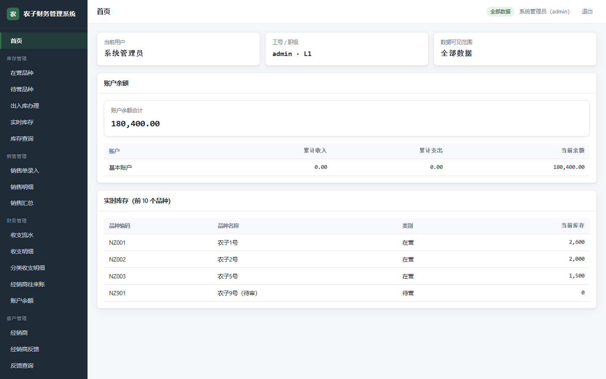
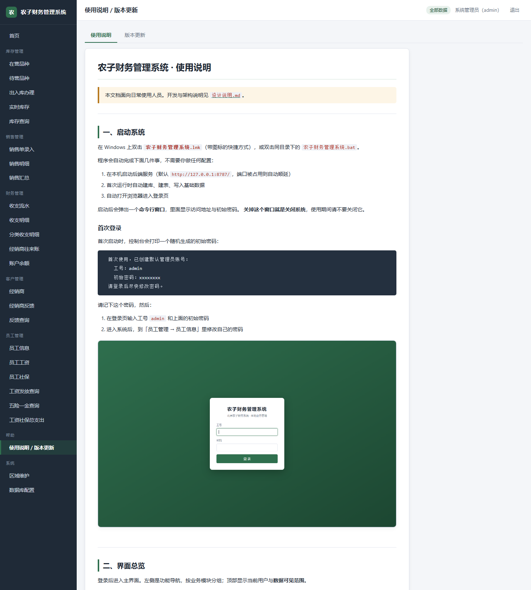
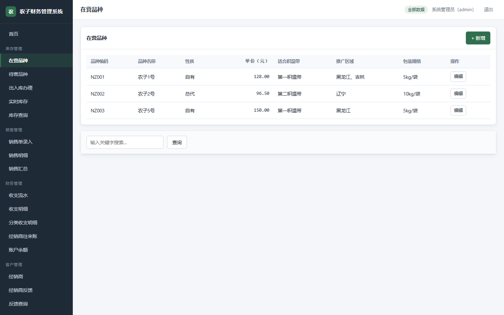
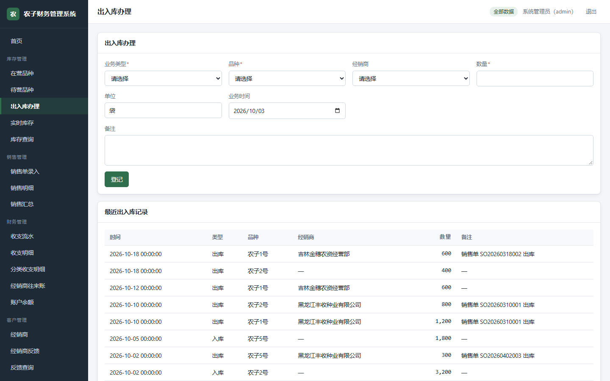
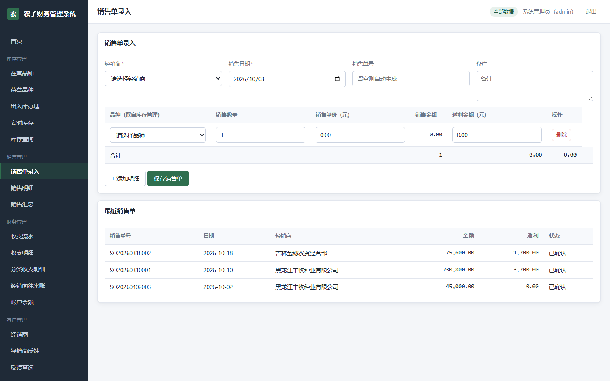
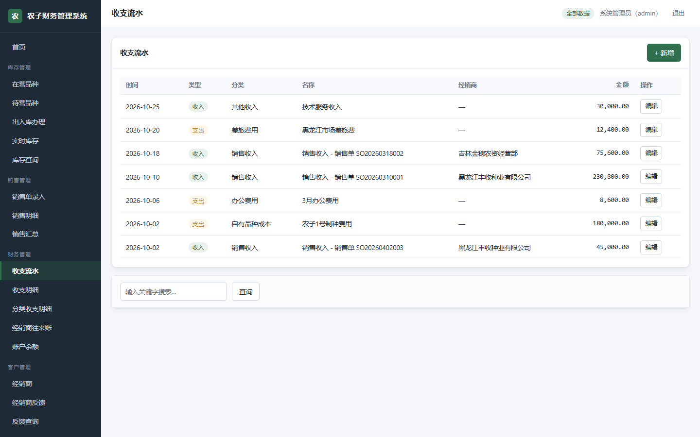
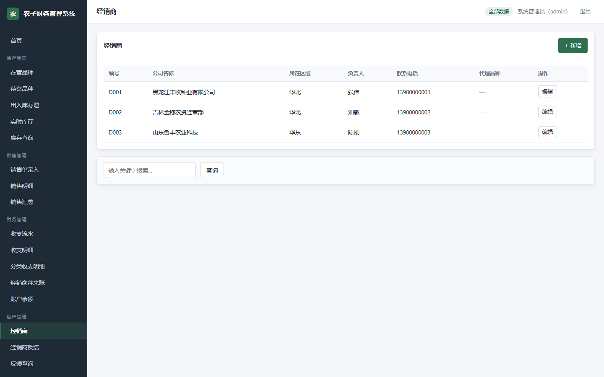
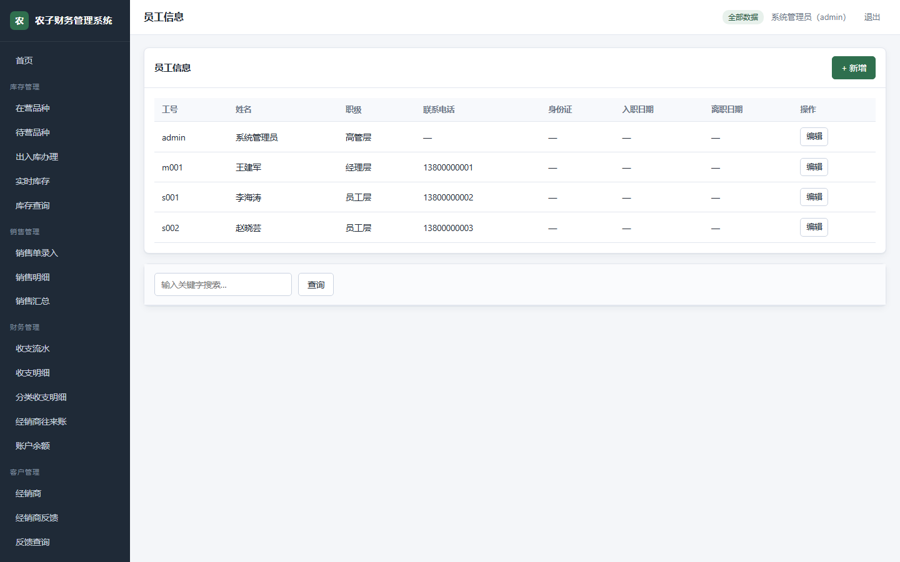

# 农子财务管理系统 · 使用说明

> 本文档面向日常使用人员。开发与架构说明见 [`设计说明.md`](设计说明.md)。

---

## 一、启动系统

在 Windows 上双击 **`农子财务管理系统.lnk`**（带图标的快捷方式），或双击同目录下的
`农子财务管理系统.bat`。

程序会自动完成下面几件事，不需要你做任何配置：

1. 在本机启动后端服务（默认 `http://127.0.0.1:8787/`，端口被占用则自动顺延）
2. 首次运行时自动建库、建表、写入基础数据
3. 自动打开浏览器进入登录页

启动后会弹出一个**命令行窗口**，里面显示访问地址与初始密码。
**关掉这个窗口就是关闭系统**，使用期间请不要关闭它。

### 首次登录

首次启动时，控制台会打印一个随机生成的初始密码：

```
  首次使用，已创建默认管理员账号：
    工号：admin
    初始密码：xxxxxxxx
  请登录后尽快修改密码。
```

请记下这个密码，然后：

1. 在登录页输入工号 `admin` 和上面的初始密码
2. 进入系统后，到「员工管理 → 员工信息」里修改自己的密码


---

## 二、界面总览

登录后进入主界面。左侧是功能导航，按业务模块分组；顶部显示当前用户与**数据可见范围**。



首页直接给出两块最常看的数据：

- **账户余额** —— 当前账户的资金情况，含累计收入、累计支出与当前余额
- **实时库存** —— 各品种的当前库存量

顶部右侧的绿色标签会显示你的数据可见范围（全部数据 / 管辖范围内数据 / 仅本人相关数据）。
这个范围由你的职级决定，**所有页面的数据都会自动按它过滤**。

### 2.1 随时查看使用说明与版本更新

左侧菜单最下方的「**帮助 → 使用说明 / 版本更新**」里就放着这份使用说明，
以及系统每次更新都改了什么，不需要另外去找文件。这个入口**对所有职级开放**——
新人第一次上手时，不必等人来教。



页面顶部有两个标签：

| 标签 | 内容 |
| --- | --- |
| **使用说明** | 就是本文档，操作时随时可以对照着看 |
| **版本更新** | 按版本列出每次更新「新增 / 改进 / 修复」了什么，可用来确认功能是不是最新版 |

---

## 三、库存管理

### 3.1 录入经营品种

「库存管理 → 在营品种」用于登记公司当前正在经营的品种。



点右上角「+ 新增」填写表单。其中：

- **品种编码**、**品种名称**、**品种性质**、**单价** 是必填项
- 「品种性质」只能选 **总代** 或 **自有**，它决定后续财务上归入哪一类成本
- 「品种特点」「政策」「阶梯返」等都是自由文本，可以写详细些，销售和财务环节会看到

计划经营、尚未正式投入的品种，请在「**待营品种**」里登记（字段不同：填预国审年份、
试点包装规格等）。等品种正式获批后，可以直接把待营品种转为在营，不用重新录一遍。

### 3.2 办理出入库

「库存管理 → 出入库办理」用于登记每一次进货与出货。



使用步骤：

1. 先选 **业务类型**（入库 / 出库）
2. 再选 **品种** —— 选完之后，页面上方会**立即显示该品种的当前库存**，方便核对
3. 填写数量、业务时间（默认今天），出库时可一并选择经销商
4. 点「登记」

页面下半部分是该品种最近的出入库记录，登记完会自动刷新。

> **实时库存不需要手工维护**。系统按「累计入库 − 累计出库」自动计算，
> 每次出入库登记后立即更新，因此不会出现库存与流水对不上的情况。

---

## 四、销售管理

### 4.1 录入销售单

「销售管理 → 销售单录入」。



使用步骤：

1. 选择 **经销商**（列表来自客户管理，名称与电话会自动带出）
2. 确认 **销售日期**；销售单号留空则系统自动生成
3. 点「+ 添加明细」增加一行，选择品种、填写数量与单价
   - 选中品种后，**单价会自动带出品种档案上的单价**，可以手工改
   - 「销售金额」由 数量 × 单价 自动算出，不需要填
   - 「返利金额」手工填写
4. 点「保存销售单」

保存时系统会做两件事，都在同一个事务里完成，**要么全成功要么全失败**：

- 写入销售单，并**自动生成对应的出库流水**，该品种的实时库存随之减少
- 按设置自动生成一笔「销售收入」财务流水

> **库存不足时系统会拒绝开单**并提示当前库存与所需数量。
> 如果确实需要超卖（例如预收款先开单），请在录入时勾选「允许库存为负」。

页面下方列出最近的销售单，可随时核对。

### 4.2 查询销售数据

「销售管理 → 销售明细」与「销售汇总」分别按行、按组合计展示销售数据。
两个页面都支持按 **时间段** 查询，并可再按 **品种**、**经销商** 过滤：

- 只选品种 → 该品种下所有经销商的销售情况
- 只选经销商 → 该经销商经营的所有品种的销售情况
- 两个都选 → 精确到「某品种卖给某经销商」
- 汇总页还有「按经销商拆分」选项，用于看同一品种在不同经销商之间的分布

---

## 五、财务管理

### 5.1 登记收入与支出

「财务管理 → 收支流水」。



点「+ 新增」，先选 **收支类型**（收入 / 支出），再选 **分类**。分类决定了这笔钱计入哪一项：

| 类型 | 可选分类 |
| --- | --- |
| 收入 | 销售收入、其他收入 |
| 支出 | 总代品种成本、自有品种成本、办公费用、差旅费用、招待费用、其他支出 |

> 选到「总代品种成本」或「自有品种成本」时，还需要填写**成本明细**
> （采购价格 / 运输费用 / 制种费用 / 加工费用）。
> 各项明细之和必须等于总金额，填不一致系统会拒绝保存——这能挡住大部分录入错误。

销售单产生的收入流水是系统自动生成的，不需要手工补录。

### 5.2 查询财务数据

| 需求 | 页面 |
| --- | --- |
| 某时间段收支明细 | 财务管理 → 收支明细 |
| 分类收入 / 支出明细（含成本明细） | 财务管理 → 分类收支明细 |
| 某经销商的往来账 | 财务管理 → 经销商往来账 |
| 当前账户余额 | 财务管理 → 账户余额 |

「收支明细」页面顶部会给出该时间段的**收入合计、支出合计与结余**三个数字，
下方是按分类的明细表。

---

## 六、客户管理

### 6.1 录入经销商

「客户管理 → 经销商」。



字段说明：

- **编号**、**公司名称** 必填
- **所在区域** 决定该经销商归哪个区域的经理管辖，进而决定哪些人能查到它
- **代理品种 / 试点品种** 从品种列表里多选，名称由系统自动带出，不需要手打

### 6.2 录入与查询反馈

「客户管理 → 经销商反馈」用于登记经销商对某个品种的反馈（反馈日期 + 反馈内容）。

「客户管理 → 反馈查询」支持按时间段查询，维度与销售查询一致：

- 按品种：某品种在某时间段所有经销商的反馈 / 某品种某经销商的反馈
- 按经销商：某经销商在某时间段所有品种的反馈 / 某经销商对某品种的反馈

---

## 七、员工管理

### 7.1 录入员工

「员工管理 → 员工信息」。



字段说明：

- **员工工号**、**姓名**、**职级** 必填
- **职级** 直接决定这个人的查询权限，是整套权限体系的基础：

  | 职级 | 含义 | 能看什么 |
  | --- | --- | --- |
  | L1 高管层 | 全部查询 | 系统内所有数据 |
  | L2 经理层 | 管辖管理查询 | 其分管区域、分管品种及下属产生的数据 |
  | L3 员工层 | 操作 | 仅本人经手的记录 |

- **初始密码** 新建时填写，员工首次登录后应自行修改；留空则此人无法登录
- **身份证** 与 **家庭住址** 属于敏感信息，**只有 L1 高管层能看到完整内容**，
  其他职级看到的是打码后的结果

### 7.2 工资与社保

- 「员工管理 → 员工工资」登记 基本工资 / 绩效工资 / 年终奖
- 「员工管理 → 员工社保」登记 社保缴纳基数、公司及个人承担的公积金与社保金额

两者都按「员工 + 所属期（年-月）」唯一，**同一个月重复录入会覆盖上一次**，
录错月份直接重录即可修正。

### 7.3 查询工资与社保支出

「员工管理」下有三个报表，均支持按时间段与员工筛选：

| 页面 | 回答的问题 |
| --- | --- |
| 工资发放查询 | 某员工 / 所有员工在某时间段发了多少工资 |
| 五险一金查询 | 某员工 / 所有员工公司承担的五险一金（只算公司部分） |
| 工资社保总支出 | 某员工工资 + 公司承担五险一金的合计 |

---

## 八、系统设置（仅 L1 可见）

「系统 → 数据库配置」可以查看与修改数据库连接信息。

系统默认使用**内嵌 SQLite**，开箱即用，不需要任何配置。如需切换到 MySQL、
PostgreSQL 或 SQL Server：

1. 选择数据库类型，填写地址、端口、库名、账号、密码
2. 保存后**需要重启程序**才会生效
3. 对应数据库的驱动需要已安装（参见 README）

「系统 → 区域维护」用于维护区域树。区域是 L2 经理「管辖范围」的基础，
新增区域时可以指定上级区域，形成「华北 → 河北 → 石家庄」这样的层级；
经理分管某个区域时，其下级区域会自动包含在内。

---

## 九、常见问题

**双击后窗口一闪而过？**
说明 Node.js 运行环境没找到或启动即失败。请在命令行里手动运行一次以看到完整报错：

```bat
cd /d E:\claude-demo\农子财务系统需求
农子财务管理系统.bat
```

**浏览器里的地址不是 8787？**
说明 8787 端口被别的程序占用，系统自动顺延到了 8788、8789……这是正常的，
浏览器打开的始终是实际端口。

**刷新页面后要重新登录吗？**
不需要。登录状态在同一个标签页内有效，刷新会自动恢复；关闭标签页后需要重新登录。

**查不到数据？**
先看顶部右侧的「数据可见范围」标签。如果显示「管辖范围内数据」，
说明你只能看到分管范围内的记录，这是权限设计的预期行为，不是数据丢失。

**某个页面显示「该时间段内没有符合条件的数据」？**
报表默认查询**当月**。如果数据是其它月份的，请把页面上的起止日期改到对应区间。
